# Hospital Management System (HMS) — Knowledge Transfer Document

**Version:** 2.0  
**Date:** March 2026  
**Audience:** New developers joining the HMS project  
**Prepared by:** Technical Architecture Team  
**Diagrams:** Mermaid (render in GitHub, VS Code, or any Mermaid-capable viewer)

---

## Table of Contents

1. [Project Overview](#1-project-overview)
2. [System Architecture](#2-system-architecture)
3. [Technology Stack](#3-technology-stack)
4. [Project Structure](#4-project-structure)
5. [Database Design](#5-database-design)
6. [API Architecture](#6-api-architecture)
7. [Key Modules](#7-key-modules)
8. [Data Flow](#8-data-flow)
9. [Security](#9-security)
10. [Logging and Monitoring](#10-logging-and-monitoring)
11. [Deployment Architecture](#11-deployment-architecture)
12. [Performance and Scaling](#12-performance-and-scaling)
13. [Important Design Patterns Used](#13-important-design-patterns-used)
14. [Common Issues and Troubleshooting](#14-common-issues-and-troubleshooting)
15. [Local Setup Guide](#15-local-setup-guide)
16. [KT Session Plan](#16-kt-session-plan)

---

## 1. Project Overview

### Project Name
**HMS — Hospital Management System**

### Business Purpose
HMS is an enterprise-grade, end-to-end hospital management platform that digitizes the entire hospital workflow from patient registration through discharge. It replaces paper-based processes with a real-time, role-based web application covering clinical, administrative, diagnostic, billing, and support services.

### Problem the System Solves
- Manual patient registration with duplicate records and lost UHIDs
- Disconnected department workflows (reception → OPD → IPD → billing → pharmacy → lab)
- No real-time bed availability or admission queue visibility
- Paper prescriptions, manual lab result tracking, and delayed reports
- Untracked billing, payments, and insurance claims
- No centralized role-based access control across hospital departments

### Target Users
| Role | Department | Primary Tasks |
|------|-----------|---------------|
| ADMIN / SUPER_ADMIN | IT / Management | Full system access, user management, configuration |
| RECEPTIONIST / FRONT_DESK | Reception | Patient registration, appointments, walk-ins, tokens |
| DOCTOR | OPD / IPD / Emergency | Consultations, orders, admission recommendations, discharge |
| NURSE | Nursing | Vitals, medication administration, nursing notes, bed shifts |
| PHARMACIST | Pharmacy | Medicine dispensing, stock management, FEFO, rack management |
| LAB_TECH | Laboratory | Sample collection, processing, result entry, verification |
| BILLING | Finance | Billing accounts, payments, refunds, EMI, corporate, TPA |
| IPD_MANAGER | Inpatient | Admissions, transfers, discharge, priority queue |
| HOUSEKEEPING | Support | Cleaning tasks, laundry, dietary, meal service |
| HR_MANAGER | HR | Employee management (placeholder) |
| RADIOLOGY_TECH | Radiology | Imaging reports (placeholder) |
| HELP_DESK | Front Office | Patient search (read-only) |

### Patient Journey (Business Flow)

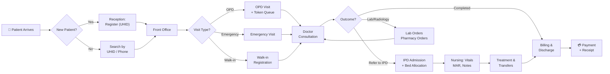

### Key Features
- **Patient Registration** — UHID auto-generation (HMS-YYYY-XXXXXX), demographics, corporate linking
- **OPD** — Visit registration, token queue, doctor consultation, clinical notes, referrals
- **IPD** — 11-step admission-to-discharge SOP, bed management, priority evaluation (P1-P4), transfers
- **Appointments** — Booking, queue, doctor schedules, walk-in conversion
- **Laboratory** — Test master, orders, sample collection, processing, result entry, verification, PDF reports, TAT monitoring
- **Pharmacy** — Medicine master, FEFO stock, rack management, IPD issue queue, barcode import, PDF invoices
- **Billing** — Account per admission/visit, auto-charges, payments (Cash/Card/UPI), refunds, EMI, corporate, TPA/insurance, online payment (Razorpay stub)
- **Nursing** — Staff management, assignments, vitals, MAR, nursing notes with search/print/lock
- **Support Services** — Housekeeping tasks, laundry/linen, dietary plans, patient meals
- **RBAC** — Dynamic permission matrix (Admin → Modules → Permissions per role), JWT auth, feature toggles
- **Night Mode** — Full dark theme with CSS variable theming

---

## 2. System Architecture

### High-Level Architecture Diagram

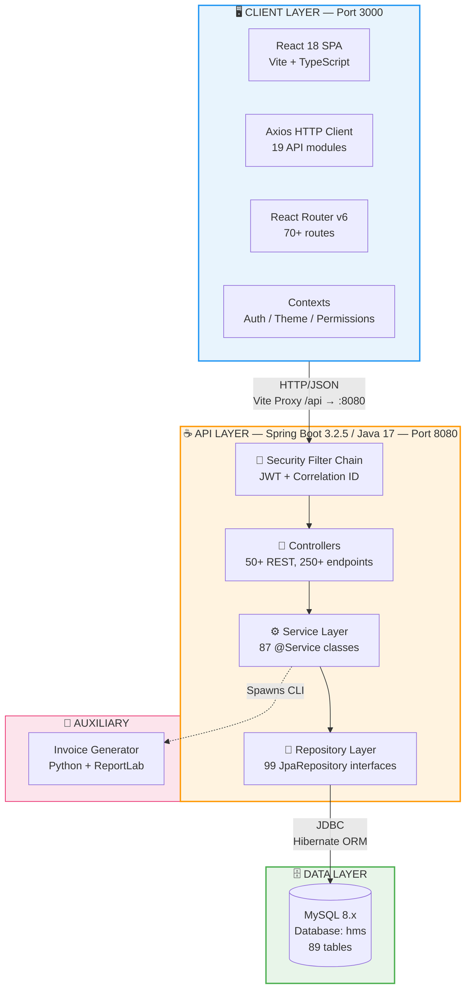

### Architecture Pattern
**Modular Monolith** — Single deployable Spring Boot application with domain-driven package structure. Each domain (reception, opd, ipd, billing, pharmacy, lab, nursing, etc.) is a self-contained package with its own controller/service/repository/entity/dto layers, communicating via direct service injection within the same JVM.

This is not microservices — there is one JAR, one database, one port. However, the package boundaries are clean enough that extraction to microservices is feasible per module.

### Module Interaction Map

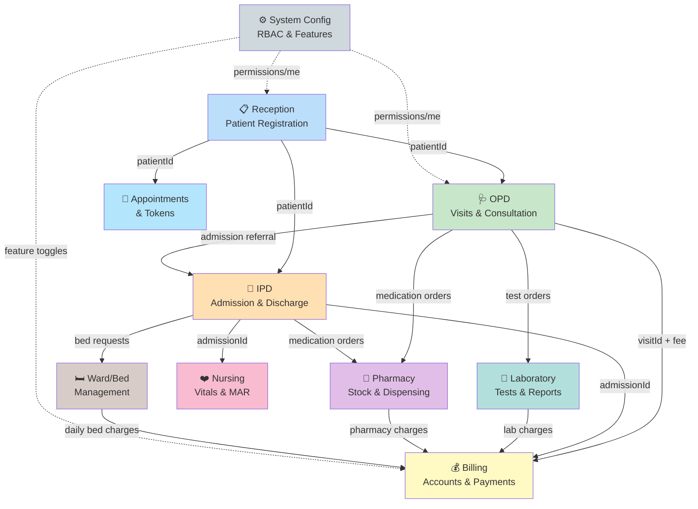

### Infrastructure Architecture
- **Dev:** Local MySQL + `mvn spring-boot:run` + `npm run dev` (Vite dev server with proxy)
- **Prod:** Spring Boot JAR + MySQL on same or separate hosts; frontend `npm run build` → static files served by a reverse proxy (Nginx/Caddy) that forwards `/api` to Spring Boot
- **No containerization yet** — no Dockerfile or docker-compose in repo
- **No CI/CD pipelines** — no GitHub Actions, Jenkins, or GitLab CI configs

### Deployment Flow (Current)
```
Developer → git push → Manual build → mvn package → java -jar hms.jar
                                     → npm run build → Deploy dist/ to web server
```

---

## 3. Technology Stack

### Technology Stack Overview

```mermaid
block-beta
  columns 4
  block:frontend["Frontend"]:2
    React["React 18"]
    TS["TypeScript 5.6"]
    Vite["Vite 5.4"]
    RRD["React Router 6"]
    Axios["Axios 1.6"]
    Bootstrap["Bootstrap 5"]
  end
  block:backend["Backend"]:2
    Java["Java 17"]
    SB["Spring Boot 3.2"]
    JPA["Spring Data JPA"]
    SS["Spring Security"]
    JWT["Auth0 JWT 4.5"]
    Hibernate["Hibernate 6"]
  end
  block:data["Data & Storage"]:2
    MySQL["MySQL 8.x"]
    Flyway["Flyway (ready)"]
  end
  block:tools["Build & Tools"]:2
    Maven["Maven 3.x"]
    npm["npm 9+"]
    POI["Apache POI"]
    PDF["OpenPDF"]
  end

  style frontend fill:#e3f2fd,stroke:#1976D2
  style backend fill:#fff3e0,stroke:#F57C00
  style data fill:#e8f5e9,stroke:#388E3C
  style tools fill:#f3e5f5,stroke:#7B1FA2
```

### Backend
| Technology | Version | Purpose |
|-----------|---------|---------|
| Java | 17 | Language runtime |
| Spring Boot | 3.2.5 | Application framework |
| Spring Data JPA | (via starter) | ORM / repository abstraction |
| Spring Security | (via starter) | Authentication and authorization |
| Spring Boot Actuator | (via starter) | Health checks, metrics |
| Auth0 java-jwt | 4.5.0 | JWT token creation and verification |
| Hibernate | (via Spring Boot) | JPA implementation, DDL auto-generation |
| MySQL Connector/J | (runtime) | JDBC driver |
| Flyway | (classpath, disabled) | Database migration framework (ready for activation) |
| Apache POI | 5.2.5 | Excel import/export (medicine import) |
| OpenPDF (LibrePDF) | 1.3.38 | PDF generation (lab reports) |
| Maven | 3.x | Build and dependency management |

### Database
| Technology | Purpose |
|-----------|---------|
| MySQL 8.x | Primary relational database |
| Hibernate DDL auto-update | Schema creation/modification on startup |

### Frontend
| Technology | Version | Purpose |
|-----------|---------|---------|
| React | 18.2.x | UI library |
| TypeScript | ~5.6 | Type safety |
| Vite | 5.4.x | Dev server and build tool |
| React Router DOM | 6.22.x | Client-side routing |
| Axios | 1.6.x | HTTP client |
| Bootstrap 5 | 5.3.x | Base CSS framework |
| CSS Modules | (native) | Scoped component styling |

### Auxiliary Services
| Technology | Purpose |
|-----------|---------|
| Python + ReportLab | Pharmacy invoice PDF generation |
| FastAPI (optional) | HTTP wrapper around invoice generator |

### Messaging / Queues
None — synchronous request/response only. No Kafka, RabbitMQ, or event bus.

### Cloud / Hosting
No cloud-specific configuration. Designed to run on any Linux/Windows server with Java 17 and MySQL.

### CI/CD Tools
Not yet configured. Recommended: GitHub Actions or Jenkins for build/test/deploy pipeline.

---

## 4. Project Structure

### Repository Layout
```
HospitalManagement/
├── backend/                     # Spring Boot application
│   ├── pom.xml                  # Maven dependencies
│   ├── src/main/java/com/hospital/hms/
│   │   ├── HmsApplication.java  # @SpringBootApplication, @EnableScheduling
│   │   ├── common/              # Shared: BaseEntity, exceptions, logging
│   │   ├── config/              # SecurityConfig, ProductionSecurityValidator
│   │   ├── auth/                # AppUser, JWT, login, dev user seeding
│   │   ├── reception/           # Patient registration, UHID
│   │   ├── doctor/              # Doctors, departments, availability
│   │   ├── opd/                 # OPD visits, tokens, clinical notes
│   │   ├── ipd/                 # Admissions, transfers, discharge, priority
│   │   ├── appointment/         # Appointments, doctor schedules
│   │   ├── token/               # Token queue system
│   │   ├── billing/             # Accounts, items, payments, EMI, corporate
│   │   ├── payment/             # Online payment (Razorpay/Stripe stub)
│   │   ├── pharmacy/            # Medicines, stock, racks, invoices
│   │   ├── lab/                 # Lab orders, tests, results, reports, TAT
│   │   ├── nursing/             # Notes, vitals, staff, assignments, MAR
│   │   ├── ward/                # Wards, rooms, beds
│   │   ├── hospital/            # Hospitals, bed availability
│   │   ├── housekeeping/        # Housekeeping tasks
│   │   ├── laundry/             # Linen inventory
│   │   ├── meals/               # Patient meals
│   │   ├── dietary/             # Diet plans
│   │   ├── walkin/              # Walk-in registration
│   │   ├── dashboard/           # Dashboard statistics
│   │   └── system/              # RBAC: roles, modules, permissions, features
│   └── src/main/resources/
│       └── application.yml      # Multi-profile config (dev/prod)
├── frontend/                    # React SPA
│   ├── package.json
│   ├── vite.config.ts           # Proxy /api → :8080
│   ├── src/
│   │   ├── main.tsx             # Entry: ErrorBoundary → Bootstrap → Router → Theme → Auth → App
│   │   ├── App.tsx              # All routes (70+ routes)
│   │   ├── index.css            # CSS variables, light/dark themes
│   │   ├── api/                 # 19 API client modules (Axios)
│   │   ├── components/          # Layout, Sidebar, ProtectedRoute, module components
│   │   ├── config/              # Menu, permissions, feature flags, page titles
│   │   ├── contexts/            # AuthContext, ThemeContext, PermissionsContext
│   │   ├── pages/               # 87 page components across 12 subfolders
│   │   ├── services/            # Frontend service abstractions
│   │   ├── types/               # 20 TypeScript type definition files
│   │   ├── utils/               # Shared utilities
│   │   └── styles/              # Shared CSS modules
│   └── scripts/
│       └── wait-for-backend.js  # Health-check poller
├── invoice-generator/           # Python PDF service
│   ├── invoice_service.py       # ReportLab PDF generation
│   ├── app.py                   # Optional FastAPI wrapper
│   └── requirements.txt         # reportlab, fastapi, uvicorn
├── docs/                        # Module documentation (7 markdown files)
├── scripts/
│   └── wait-for-backend.ps1     # PowerShell health check
├── start.bat                    # Unified Windows startup
├── start.ps1                    # PowerShell startup
└── README.md
```

### Backend Package Anatomy (Each Domain Module)
```
com.hospital.hms.<module>/
├── controller/    # REST endpoints (@RestController, @RequestMapping, @PreAuthorize)
├── service/       # Business logic (@Service, @Transactional)
├── repository/    # Data access (extends JpaRepository, custom @Query)
├── entity/        # JPA entities (@Entity, @Table), enums
├── dto/           # Request/Response DTOs (validation annotations)
└── config/        # Module-specific beans, data loaders (@Configuration)
```

### Spring Boot Layered Architecture (Per Module)

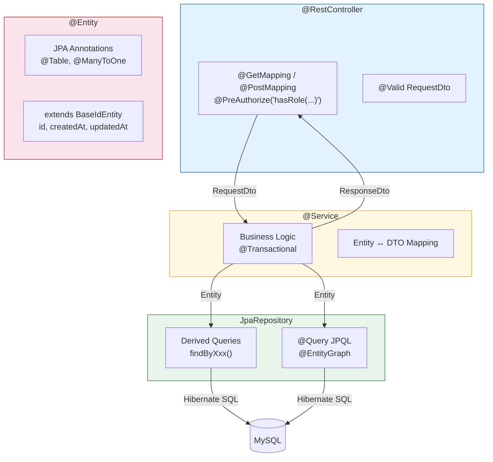

### Frontend Anatomy
| Layer | Files | Purpose |
|-------|-------|---------|
| **`api/`** | `client.ts` + 18 domain modules | Axios HTTP calls, interceptors, auth headers |
| **`contexts/`** | `AuthContext`, `ThemeContext`, `PermissionsContext` | Global state (auth, theme, RBAC) |
| **`config/`** | `sidebarMenu.ts`, `menuFilter.ts`, `featureFlags.ts` | Menu structure, role filtering, feature toggles |
| **`pages/`** | 87 components | Route-level UI (one per screen) |
| **`components/`** | `Layout`, `Sidebar`, guards, domain components | Reusable UI pieces |
| **`types/`** | 20 type files | TypeScript interfaces matching backend DTOs |
| **`services/`** | 6 service files | Frontend logic (bed census, availability) |

### Frontend React Provider Stack

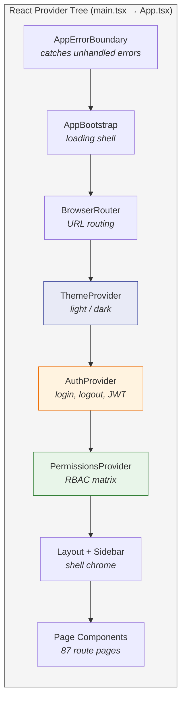

---

## 5. Database Design

### Schema Management
- **Hibernate `ddl-auto: update`** — tables are auto-created and altered on startup
- **Flyway** is on the classpath but **disabled** (`flyway.enabled: false`); ready for activation when migration scripts are written
- **No manual SQL migration files** exist yet

### Entity Hierarchy
All entities extend `BaseIdEntity` → `BaseEntity`:
- **`BaseEntity`** — `createdAt` (Instant, `@PrePersist`), `updatedAt` (Instant, `@PreUpdate`)
- **`BaseIdEntity`** — `id` (Long, `@GeneratedValue(IDENTITY)`)

### Major Tables (89 JPA Entities)

#### Core / Administration
| Entity | Table | Key Relationships |
|--------|-------|-------------------|
| `AppUser` | `hms_users` | Standalone; `role` (enum) |
| `SystemRole` | `system_roles` | Referenced by `RoleModulePermission` |
| `SystemModule` | `system_modules` | Referenced by `RoleModulePermission` |
| `RoleModulePermission` | `role_module_permissions` | `@ManyToOne` → `SystemRole`, `SystemModule` |
| `FeatureToggle` | `feature_toggles` | Standalone |
| `Hospital` | `hospitals` | Referenced by `BedAvailability` |

#### Reception / Patient
| Entity | Table | Key Relationships |
|--------|-------|-------------------|
| `Patient` | `patients` | Standalone; UHID unique; referenced by OPD/IPD/Billing |

#### Clinical — OPD
| Entity | Table | Key Relationships |
|--------|-------|-------------------|
| `OPDVisit` | `opd_visits` | `@ManyToOne` → Patient, Doctor, Department |
| `OPDClinicalNote` | `opd_clinical_notes` | `@OneToOne` → OPDVisit |
| `OPDToken` | `opd_tokens` | `@ManyToOne` → OPDVisit |

#### Clinical — IPD
| Entity | Table | Key Relationships |
|--------|-------|-------------------|
| `IPDAdmission` | `ipd_admissions` | `@ManyToOne` → Patient, Doctor, Bed |
| `BedAllocation` | `bed_allocations` | `@ManyToOne` → IPDAdmission, Bed |
| `PatientTransfer` | `patient_transfers` | `@ManyToOne` → IPDAdmission, from/to Bed |
| `PatientDischarge` | `patient_discharges` | `@ManyToOne` → IPDAdmission |
| `AdmissionPriority` | `admission_priorities` | `@ManyToOne` → IPDAdmission |

#### Ward / Bed Infrastructure
| Entity | Table | Key Relationships |
|--------|-------|-------------------|
| `Ward` | `wards` | `@ManyToOne` → Hospital |
| `Room` | `rooms` | `@ManyToOne` → Ward |
| `Bed` | `beds` | `@ManyToOne` → Room |
| `BedAvailability` | `bed_availabilities` | `@ManyToOne` → Hospital |
| `WardTypeMaster` | `ward_type_masters` | Standalone |

#### Billing
| Entity | Table | Key Relationships |
|--------|-------|-------------------|
| `PatientBillingAccount` | `patient_billing_accounts` | FK → Patient, optional IPDAdmission/OPDVisit |
| `BillingItem` | `billing_items` | FK → PatientBillingAccount |
| `Payment` | `payments` | FK → PatientBillingAccount |
| `Refund` | `refunds` | FK → Payment |
| `EMIPlan` | `emi_plans` | FK → PatientBillingAccount |
| `CorporateAccount` | `corporate_accounts` | Standalone |
| `AdmissionCharge` | `admission_charges` | FK → IPDAdmission |

#### Pharmacy
| Entity | Table | Key Relationships |
|--------|-------|-------------------|
| `MedicineMaster` | `medicine_masters` | `@ManyToOne` → PharmacyRack, PharmacyShelf |
| `MedicationOrder` | `medication_orders` | FK → Patient, MedicineMaster, Doctor |
| `StockTransaction` | `stock_transactions` | FK → MedicineMaster |
| `PharmacyInvoice` | `pharmacy_invoices` | Standalone |
| `PharmacyRack` / `PharmacyShelf` | `pharmacy_racks` / `pharmacy_shelves` | Parent-child |

#### Laboratory
| Entity | Table | Key Relationships |
|--------|-------|-------------------|
| `TestMaster` | `test_masters` | Standalone |
| `TestOrder` | `test_orders` | FK → Patient, TestMaster, Doctor |
| `LabOrder` / `LabOrderItem` | `lab_orders` / `lab_order_items` | FK → LabOrder → LabOrderItem |
| `LabResult` | `lab_results` | FK → TestOrder |
| `LabReport` | `lab_reports` | `@ManyToOne` → TestOrder |

#### Nursing
| Entity | Table | Key Relationships |
|--------|-------|-------------------|
| `NursingStaff` | `nursing_staff` | Standalone |
| `NurseAssignment` | `nurse_assignments` | FK → NursingStaff, IPDAdmission |
| `VitalSignRecord` | `vital_sign_records` | FK → IPDAdmission |
| `NursingNote` | `nursing_notes` | FK → IPDAdmission |
| `MedicationAdministration` | `medication_administrations` | FK → MedicationOrder, IPDAdmission |

#### Support Services
| Entity | Table | Key Relationships |
|--------|-------|-------------------|
| `HousekeepingTask` | `housekeeping_tasks` | Optional FK → Ward/Bed |
| `LinenInventory` | `linen_inventory` | Standalone |
| `DietPlan` | `diet_plans` | FK → Patient, IPDAdmission |
| `PatientMeal` | `patient_meals` | FK → Patient, IPDAdmission |

#### Appointments / Tokens
| Entity | Table | Key Relationships |
|--------|-------|-------------------|
| `Appointment` | `appointments` | FK → Patient, Doctor, Department |
| `DoctorSchedule` | `doctor_schedules` | FK → Doctor |
| `Token` | `tokens` | FK → Patient, Doctor |
| `DoctorAvailability` | `doctor_availabilities` | FK → Doctor |

### Important Indexes
Most entities define explicit indexes in `@Table(indexes = {...})`:
- `hms_users`: unique on `username`, index on `role`
- `patients`: unique on `uhid`, index on `phone`, `registrationDate`
- `opd_visits`: index on `patientId`, `doctorId`, `visitDate`, `visitStatus`
- `ipd_admissions`: index on `patientId`, `status`, `admissionDate`
- `medicine_masters`: index on `code` (unique), `name`, `rackId`
- `test_orders`: index on `patientId`, `status`, `orderedDate`
- `system_modules`: unique on `code`, index on `category`, `enabled`

### ER Relationship Summary

```mermaid
erDiagram
    Patient ||--o{ OPDVisit : "has visits"
    Patient ||--o{ IPDAdmission : "has admissions"
    Patient ||--o{ PatientBillingAccount : "has accounts"
    Patient ||--o{ TestOrder : "has tests"
    Patient ||--o{ MedicationOrder : "has medications"
    Patient ||--o{ Appointment : "has appointments"

    Doctor ||--o{ OPDVisit : "conducts"
    Doctor ||--o{ IPDAdmission : "attends"
    Doctor ||--o{ DoctorAvailability : "has slots"
    Doctor ||--o{ DoctorSchedule : "has schedule"

    OPDVisit ||--o| OPDClinicalNote : "has note"
    OPDVisit ||--o| OPDToken : "has token"

    IPDAdmission ||--o{ BedAllocation : "allocated beds"
    IPDAdmission ||--o{ PatientTransfer : "transfers"
    IPDAdmission ||--o| PatientDischarge : "discharge"
    IPDAdmission ||--o{ VitalSignRecord : "vitals"
    IPDAdmission ||--o{ NursingNote : "notes"
    IPDAdmission ||--o{ MedicationAdministration : "meds given"
    IPDAdmission ||--o{ NurseAssignment : "nurses"

    PatientBillingAccount ||--o{ BillingItem : "line items"
    PatientBillingAccount ||--o{ Payment : "payments"
    Payment ||--o{ Refund : "refunds"

    TestOrder ||--o{ LabResult : "results"
    TestOrder }o--|| TestMaster : "test type"

    Hospital ||--o{ Ward : "has wards"
    Ward ||--o{ Room : "has rooms"
    Room ||--o{ Bed : "has beds"

    SystemRole ||--o{ RoleModulePermission : "permissions"
    SystemModule ||--o{ RoleModulePermission : "permissions"

    MedicineMaster ||--o{ StockTransaction : "stock"
    MedicineMaster ||--o{ MedicationOrder : "orders"
    PharmacyRack ||--o{ PharmacyShelf : "shelves"
```

**Text summary:**
```
Patient ──1:N──> OPDVisit ──1:1──> OPDClinicalNote
Patient ──1:N──> IPDAdmission ──1:N──> BedAllocation
                                  ──1:N──> PatientTransfer
                                  ──1:1──> PatientDischarge
                                  ──1:N──> VitalSignRecord
                                  ──1:N──> NursingNote
                                  ──1:N──> MedicationAdministration
Patient ──1:N──> PatientBillingAccount ──1:N──> BillingItem
                                       ──1:N──> Payment ──1:N──> Refund
Patient ──1:N──> TestOrder ──1:N──> LabResult
Patient ──1:N──> MedicationOrder
Patient ──1:N──> Appointment
Doctor ──1:N──> OPDVisit
Doctor ──1:N──> IPDAdmission
Doctor ──1:N──> DoctorAvailability
Ward ──1:N──> Room ──1:N──> Bed
Hospital ──1:N──> BedAvailability
SystemRole ──N:M──> SystemModule (via RoleModulePermission)
```

---

## 6. API Architecture

### REST API Design
- **Base URL:** `http://localhost:8080/api` (context-path: `/api`)
- **50+ REST controllers** with over 250 endpoints
- **URL convention:** `/api/<module>/<resource>` (e.g. `/api/opd/visits`, `/api/billing/payment`, `/api/pharmacy/medicines`)
- **HTTP methods:** GET (read), POST (create/action), PUT (full update), PATCH (partial update/toggle), DELETE (remove)
- **Pagination:** Spring `Pageable` → `Page<T>` response with `content`, `totalElements`, `totalPages`, `number`
- **No API versioning** — single version, evolving contract

### Authentication Mechanism (JWT)

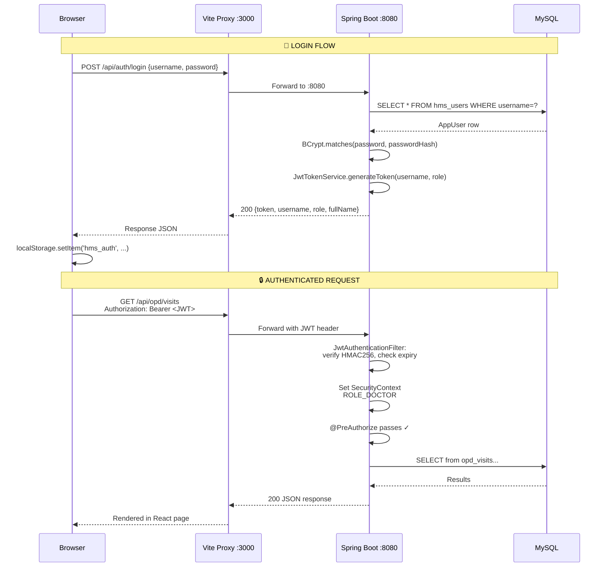

**Text summary:**
```
1. POST /api/auth/login  { username, password }
2. Server validates via AuthenticationManager + AppUserDetailsService
3. On success: JwtTokenService.generateToken(username, role)
   → JWT with claims: sub=username, role=ADMIN, iat, exp
4. Response: { token, username, role, fullName, issuedAt }
5. Client stores in localStorage (hms_auth)
6. All subsequent requests: Authorization: Bearer <token>
7. JwtAuthenticationFilter extracts + verifies token
   → Sets SecurityContext with ROLE_<role> authority
```

**Token structure:**
- Algorithm: HMAC256
- Claims: `sub` (username), `role` (UserRole enum name), `iat`, `exp`
- Expiry: configurable (default 30 minutes, `hms.security.jwt.expiry-minutes`)

### Error Handling Strategy
**`GlobalExceptionHandler`** (`@RestControllerAdvice`) returns structured JSON:
```json
{
  "status": 400,
  "message": "Human-readable error message",
  "timestamp": "2026-03-27T10:30:00Z",
  "errors": { "fieldName": "validation message" }
}
```

| Exception | HTTP Status | When |
|-----------|------------|------|
| `MethodArgumentNotValidException` | 400 | DTO validation failure (`@Valid`) |
| `IllegalArgumentException` | 400 | Business rule violation |
| `ResourceNotFoundException` | 404 | Entity not found |
| `OperationNotAllowedException` | 403 | Forbidden action (e.g. discharge without clearance) |
| `DuplicateBedAvailabilityException` | 409 | Duplicate resource |
| `DataIntegrityViolationException` | 409 | DB constraint violation |
| `InsufficientStockException` | 400 | Pharmacy stock underflow |
| `Exception` (catch-all) | 500 | Unexpected; `detail` field only in `dev` profile |

---

## 7. Key Modules

### 7.1 Authentication & User Management
**Package:** `com.hospital.hms.auth`

- **`AppUser`** entity — `hms_users` table: username (unique), passwordHash (BCrypt), fullName, role (UserRole enum: 25 roles), active flag
- **`AuthController`** — `/api/auth/login` (public), `/api/auth/me` (authenticated), `/api/auth/register` (ADMIN only), `/api/auth/change-password`
- **`JwtTokenService`** — HMAC256 token generation and verification
- **`JwtAuthenticationFilter`** — Extracts Bearer token, sets SecurityContext
- **`DevUserDataLoader`** — Seeds 16 dev users on startup (admin, doctor, nurse, pharmacist, lab tech, etc.)

### 7.2 Reception / Patient Registration
**Package:** `com.hospital.hms.reception`

- UHID auto-generation: `HMS-YYYY-XXXXXX` (year + sequential)
- Patient demographics: name, DOB, gender, phone, address, Aadhaar, corporate link
- APIs: register, search (UHID/phone/name), get by ID, update, enable/disable
- Integration: every downstream module references Patient by `patientId` or `patientUhid`

### 7.3 OPD (Outpatient Department)
**Package:** `com.hospital.hms.opd`

**OPD Visit Lifecycle:**

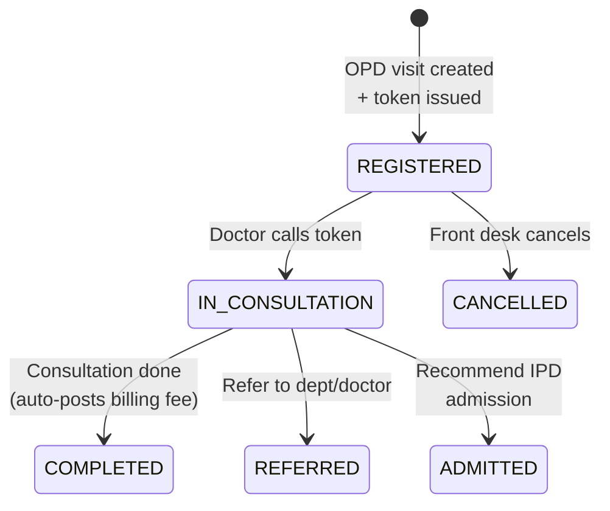

- Visit lifecycle: REGISTERED → IN_CONSULTATION → COMPLETED / REFERRED / CANCELLED
- Token queue per doctor per day (auto-numbered)
- Clinical notes (chief complaint, provisional diagnosis, doctor remarks)
- Referral (to department, doctor, or IPD admission recommendation)
- OPD consultation fee auto-posted to billing on visit completion

### 7.4 IPD (Inpatient Department)
**Package:** `com.hospital.hms.ipd`

**IPD Admission State Machine:**

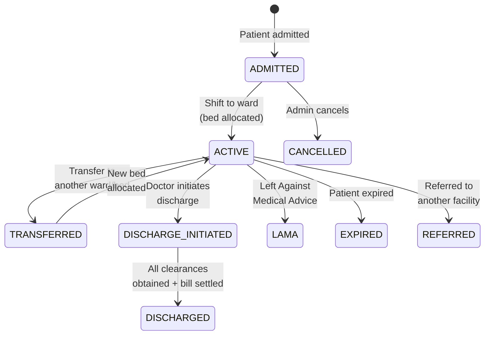

- 11-step SOP: Registration → OPD/Emergency → Priority (P1-P4) → Bed Check → Admit → Shift-to-Ward → Treatment → Transfer → Billing → Discharge → Post-Discharge
- Status lifecycle: ADMITTED → ACTIVE → TRANSFERRED → DISCHARGE_INITIATED → DISCHARGED (also CANCELLED, REFERRED, LAMA, EXPIRED)
- Admission types: OPD_REFERRAL, EMERGENCY, DIRECT
- Business rules: one active admission per patient, one active allocation per bed
- Transfer workflow: 5-step (recommend → consent → reserve bed → execute → audit)
- Priority evaluation: automated P1-P4 scoring with manual override for authorized roles

### 7.5 Billing
**Package:** `com.hospital.hms.billing`

**Billing Data Flow:**

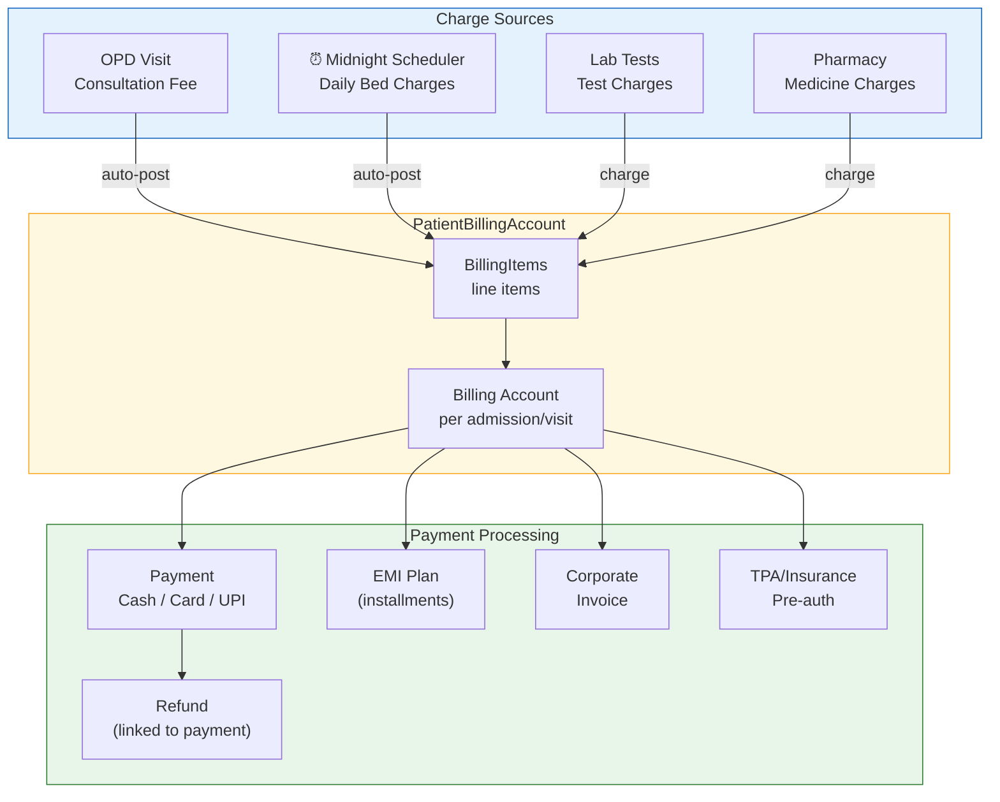

- One `PatientBillingAccount` per admission (IPD) or visit (OPD)
- `BillingItem`: line items per service (BED, PHARMACY, LAB, CONSULTATION, etc.)
- `Payment`: Cash / Card / UPI with reference number
- `BillingEngine`: orchestrates charge posting
- Auto-charges: daily bed charges (midnight scheduler), OPD consultation fee on visit completion
- Dashboard summary: today's collection, payment count, pending accounts
- EMI plans, corporate billing, TPA/insurance pre-authorization (basic)
- Refund processing tied to specific payments

### 7.6 Pharmacy
**Package:** `com.hospital.hms.pharmacy`

- Medicine master: code, name, strength, form, manufacturer, category, pricing (MRP/purchase), GST, rack/shelf location
- FEFO stock management (First Expiry First Out)
- Rack/shelf system with auto-suggestion
- Import: Excel (Apache POI), barcode/GTIN lookup (external API), manual entry
- IPD issue queue: medication orders from doctors → pharmacist dispensing
- Stock transactions: purchase, sale, return, adjustment, IPD issue
- Invoice PDF generation (via Python ReportLab)
- Expiry alerts

### 7.7 Laboratory
**Package:** `com.hospital.hms.lab`

**Lab Order Workflow:**

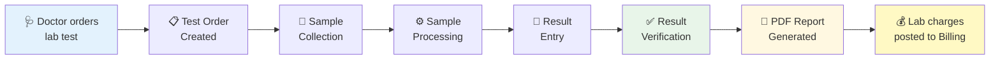

- Test master: test definitions with reference ranges, categories, panels
- Order flow: test order → sample collection → processing → result entry → verification → report
- PDF report generation (OpenPDF) with hospital branding
- Dashboard: pending counts by stage, TAT metrics
- TAT monitoring: scheduled job every 5 minutes checking breach thresholds
- Audit trail: order/status changes logged

### 7.8 Nursing
**Package:** `com.hospital.hms.nursing`

- Staff management: nurse records with codes, departments
- Assignment: nurse ↔ IPD admission mapping per shift
- Vitals: BP, pulse, temperature, SpO2, respiration (per admission)
- Medication administration record (MAR): tracks each dose given
- Nursing notes: rich text, search, print, lock for legal compliance

### 7.9 System Configuration / RBAC
**Package:** `com.hospital.hms.system`

- Dynamic roles: create/edit roles via admin UI
- Module registry: system_modules table → each module (RECEPTION, OPD, IPD, etc.)
- Permission matrix: per role × per module → actions (VIEW, CREATE, UPDATE, DELETE, APPROVE) + visibility (VISIBLE, HIDDEN, READ_ONLY)
- Feature toggles: enable/disable features without redeploy (e.g. TELEMEDICINE, ONLINE_PAYMENTS)
- Frontend sidebar driven by permission matrix via `/api/system/permissions/me`

### 7.10 Support Services
- **Housekeeping:** task creation (BED_CLEANING, ROOM_CLEANING, DISINFECTION), status tracking (PENDING → IN_PROGRESS → COMPLETED)
- **Laundry:** linen issue/return tracking
- **Dietary:** diet plan management per patient/admission
- **Meals:** daily meal tracking and service confirmation

### 7.11 Appointments & Tokens
- **Appointments:** booking, rescheduling, cancellation, no-show, conversion to OPD visit
- **Doctor schedules:** availability slots per doctor
- **Token system:** auto-numbered queue per doctor per day, call-next, start/complete/skip

---

## 8. Data Flow

### Request Flow Diagram

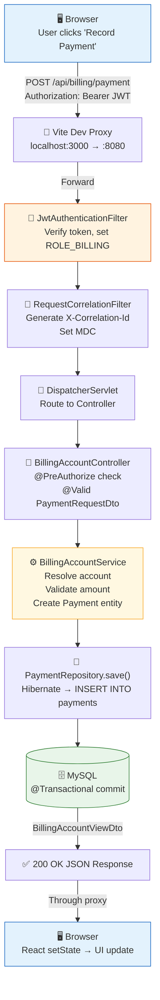

### Typical Request Flow (Example: Record Payment)

```
[1] Browser: POST /api/billing/payment
    Body: { ipdId: 42, amount: 5000, mode: "Cash" }
    Header: Authorization: Bearer <jwt-token>
          │
          ▼
[2] Vite Dev Proxy (/api → http://127.0.0.1:8080)
          │
          ▼
[3] Spring Security Filter Chain:
    a) JwtAuthenticationFilter
       - Extract "Bearer <token>" from Authorization header
       - Verify HMAC256 signature and expiration
       - Build UsernamePasswordAuthenticationToken with ROLE_BILLING
       - Set SecurityContextHolder
    b) RequestCorrelationFilter
       - Generate/propagate X-Correlation-Id (UUID)
       - Set MDC: CORRELATION_ID, USER_ID
          │
          ▼
[4] Spring DispatcherServlet → HandlerMapping
    Matches: BillingAccountController.recordPayment()
    @PreAuthorize("hasAnyRole('ADMIN', 'BILLING')") ← passes
          │
          ▼
[5] Controller: @PostMapping("/payment")
    Validates @Valid PaymentRequestDto
    Delegates to BillingAccountService.recordPayment(dto)
          │
          ▼
[6] Service Layer (BillingAccountService):
    a) Resolve billing account by ipdId
    b) Validate amount > 0 and ≤ pending
    c) Create Payment entity, set billingAccountId, mode, reference
    d) Update PatientBillingAccount.paidAmount
    e) Call PaymentRepository.save(payment)
    f) Call PatientBillingAccountRepository.save(account)
    g) Build and return BillingAccountViewDto
          │
          ▼
[7] Repository Layer:
    PaymentRepository.save() → Hibernate → INSERT INTO payments
    PatientBillingAccountRepository.save() → UPDATE patient_billing_accounts
          │
          ▼
[8] MySQL: Rows persisted within @Transactional boundary
          │
          ▼
[9] Response: 200 OK + BillingAccountViewDto JSON
    → Through filter chain (MDC cleanup)
    → Through Vite proxy
    → Browser receives updated billing view
```

### Frontend Data Flow
```
[User Action] → Page Component → API Client (axios) → HTTP Request
                                                          ↓
[State Update] ← Component setState ← Response JSON ← API Response
```

---

## 9. Security

### Security Architecture Diagram

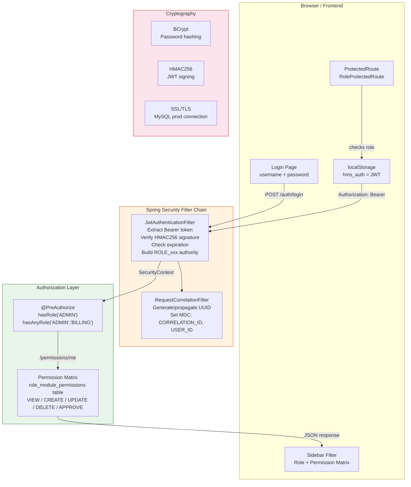

### Authentication
- **JWT Bearer Token** — stateless, no server-side sessions
- **BCrypt** password hashing (`BCryptPasswordEncoder`)
- Token expiry: configurable (default 30 min)
- Single role per user in JWT claim (no multi-role per token)

### Authorization
- **Method-level:** `@PreAuthorize` annotations on controllers (e.g. `hasRole('ADMIN')`, `hasAnyRole('ADMIN', 'BILLING')`)
- **Dynamic RBAC:** Permission matrix in `role_module_permissions` table
- **Frontend:** Route guards (`ProtectedRoute`, `RoleProtectedRoute`), sidebar filtered by role + permission matrix
- **ADMIN sees all:** Explicit bypass in both backend (`hasRole('ADMIN')` in most `@PreAuthorize`) and frontend sidebar

### Security Configuration
```java
// SecurityConfig.java
http
  .csrf(csrf -> csrf.disable())                    // Stateless API
  .sessionManagement(STATELESS)                    // No HTTP sessions
  .addFilterBefore(JwtAuthenticationFilter, ...)   // JWT extraction
  .addFilterAfter(RequestCorrelationFilter, ...)   // Correlation ID
  .authorizeHttpRequests(auth -> auth
    .requestMatchers("/actuator/health").permitAll()
    .requestMatchers("/auth/login").permitAll()
    .anyRequest().authenticated())
```

### Production Security
- **`ProductionSecurityValidator`** (`@Profile("prod")`) — fails startup if:
  - JWT secret is blank or equals `dev-jwt-secret-change-me`
  - MySQL password is blank
- **JDBC URL (prod):** `useSSL=true`, `allowPublicKeyRetrieval=false`
- **Registration:** `POST /api/auth/register` requires ADMIN JWT (not public)

### RBAC Permission Matrix Flow (Sidebar)

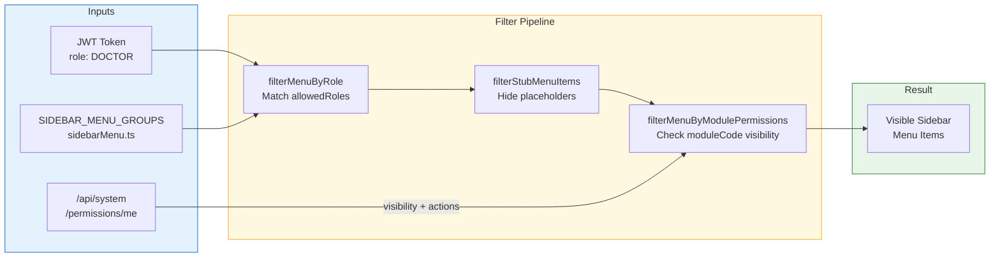

> **Note:** ADMIN and SUPER_ADMIN skip the permission matrix filter entirely — they always see the full role-based menu regardless of DB state.

### Data Protection
- Passwords: BCrypt (one-way hash, never stored in plaintext)
- JWT secret: environment variable, not in source code for prod
- Sensitive config: `application-local.yml` is gitignored
- No PII encryption at rest (MySQL standard; add TDE for compliance if needed)

---

## 10. Logging and Monitoring

### Logging & Correlation Flow

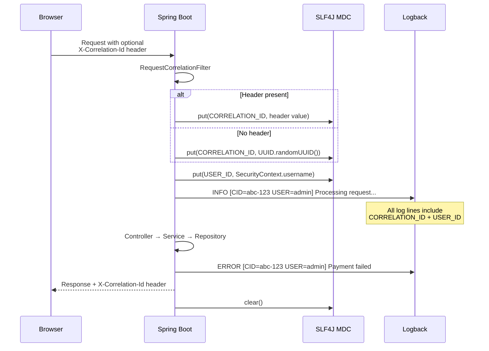

### Logging Framework
- **SLF4J + Logback** (Spring Boot default)
- **MDC (Mapped Diagnostic Context):**
  - `CORRELATION_ID` — UUID per request (propagated via `X-Correlation-Id` header)
  - `USER_ID` — authenticated username
  - `MODULE` — set by `GlobalExceptionHandler` for error context

### Log Levels
| Package | Level | Notes |
|---------|-------|-------|
| Application root | INFO | Default |
| `com.hospital.hms` | INFO | Business logging |
| Hibernate SQL | OFF | `show-sql: false` (enable for debugging) |
| Spring Security | INFO | Auth failures logged as WARN |

### Request Correlation
Every API request gets a UUID correlation ID:
- If client sends `X-Correlation-Id` header → reused
- Otherwise → generated by `RequestCorrelationFilter`
- Returned in response header `X-Correlation-Id`
- Available in all log statements via MDC

### Health Check
- **Endpoint:** `GET /api/actuator/health` (public, no auth required)
- Used by startup scripts to confirm backend readiness
- Returns `{ "status": "UP" }` when application is healthy

### Monitoring
- **Spring Boot Actuator** is on the classpath
- No external monitoring (Prometheus, Grafana, ELK) configured yet
- No alerting system configured

---

## 11. Deployment Architecture

### Environment Setup

| Environment | Profile | Database | JWT Secret | Purpose |
|-------------|---------|----------|------------|---------|
| **Development** | `dev` (default) | Local MySQL, `hms` DB | `dev-jwt-secret-change-me` | Local coding |
| **Production** | `prod` | Production MySQL (SSL) | Strong random secret (env var) | Live deployment |

No staging/QA environment is formally defined; use `dev` profile with a separate database.

### Current Deployment (Manual)

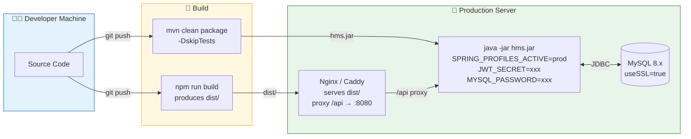

**Steps:**
```
Backend:
  1. mvn clean package -DskipTests
  2. Copy target/hms-*.jar to server
  3. SPRING_PROFILES_ACTIVE=prod JWT_SECRET=<secret> MYSQL_PASSWORD=<pw> java -jar hms.jar

Frontend:
  1. npm run build (produces dist/)
  2. Deploy dist/ to Nginx/Caddy
  3. Reverse proxy: location /api { proxy_pass http://backend:8080; }
```

### Docker (Not Yet Implemented)
No Dockerfile exists. Recommended structure for future:
```dockerfile
# Backend
FROM eclipse-temurin:17-jre
COPY target/hms-*.jar app.jar
ENTRYPOINT ["java", "-jar", "app.jar"]

# Frontend
FROM nginx:alpine
COPY dist/ /usr/share/nginx/html
COPY nginx.conf /etc/nginx/conf.d/default.conf
```

### CI/CD Pipeline (Not Yet Implemented)

**Recommended pipeline:**

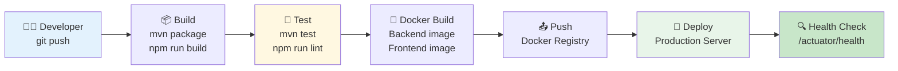

---

## 12. Performance and Scaling

### Caching Strategy
- **No application-level caching** currently (no Redis, no Spring Cache `@Cacheable`)
- Hibernate L1 cache (session-scoped) active by default
- Hibernate L2 cache: not configured
- **Recommendation:** Add `@Cacheable` for frequently read, rarely changed data (test masters, ward types, doctor lists)

### Database Optimization
- **Explicit indexes** on high-query columns (patient UHID, visit dates, admission status, medicine codes)
- **`@EntityGraph`** on select repository methods to avoid N+1 (e.g. `IPDAdmissionRepository.findByIdWithPatient`)
- **`open-in-view: false`** — prevents lazy loading in controller layer (forces explicit fetching in service/repository)
- **Pagination** on list endpoints (Spring `Pageable`)

### Load Balancing
- Not configured (single instance)
- JWT is stateless → horizontal scaling is straightforward (add instances behind a load balancer)
- Database is the bottleneck — consider read replicas for reporting queries

### Scheduled Tasks

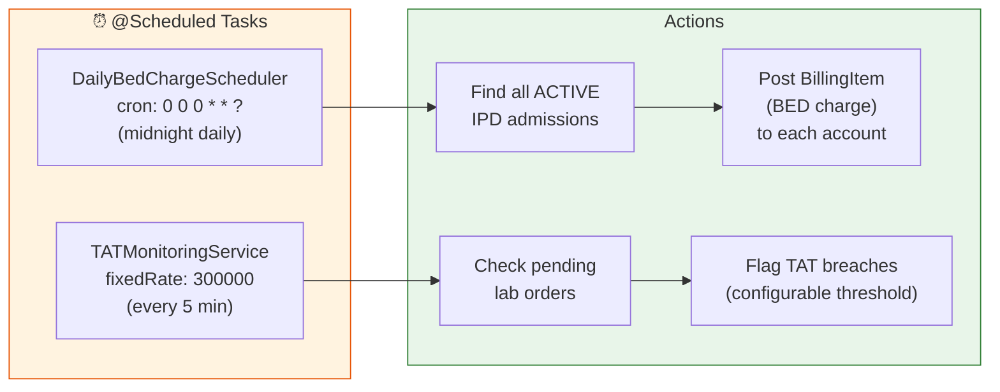

| Task | Schedule | Purpose |
|------|----------|---------|
| Daily Bed Charges | `0 0 0 * * ?` (midnight) | Post bed charges to billing accounts |
| TAT Monitoring | Every 5 minutes | Check lab order turnaround time breaches |

---

## 13. Important Design Patterns Used

### Dependency Injection (Pervasive)
Spring constructor injection across all services and controllers. No field injection (`@Autowired` on fields). Example:
```java
@Service
public class BillingAccountService {
    private final PatientBillingAccountRepository accountRepo;
    private final PaymentRepository paymentRepo;

    public BillingAccountService(PatientBillingAccountRepository accountRepo,
                                  PaymentRepository paymentRepo) {
        this.accountRepo = accountRepo;
        this.paymentRepo = paymentRepo;
    }
}
```

### Repository Pattern
Spring Data JPA repositories abstract all database access. Custom queries via `@Query` JPQL. No raw JDBC or native SQL in service layer.

### DTO Pattern (Data Transfer Objects)
Separate request/response DTOs for every API:
- `*RequestDto` — inbound (with `@Valid` annotations)
- `*ResponseDto` / `*ViewDto` — outbound (flattened, no JPA proxies)
- Manual mapping in service layer (no MapStruct/ModelMapper)

### Strategy Pattern
- **`AdmissionPriorityEvaluationService`** — evaluates admission priority based on configurable rules
- **`BillingEngine`** — routes charge posting based on service type

### Template Method
- **`BaseEntity`** — `@PrePersist` / `@PreUpdate` lifecycle callbacks for `createdAt` / `updatedAt`

### Builder Pattern
- Used informally in DTO construction (setter chains, not Lombok @Builder)

### Filter Chain Pattern
- Spring Security filter chain: `JwtAuthenticationFilter` → `RequestCorrelationFilter` → controllers
- Each filter has a single responsibility; order matters

### Observer Pattern (Implicit)
- Spring `@Scheduled` tasks observe time-based triggers
- JPA `@PrePersist` / `@PreUpdate` lifecycle callbacks

### Singleton Pattern
- All Spring beans are singletons by default (`@Service`, `@Component`, `@Configuration`)

### Provider Pattern (Frontend)
- `AuthProvider`, `ThemeProvider`, `PermissionsProvider` wrap the React component tree
- Children consume state via `useAuth()`, `useTheme()`, `usePermissions()` hooks

---

## 14. Common Issues and Troubleshooting

### 1. ECONNREFUSED on `/api/*` in Browser
**Symptom:** Frontend loads but all API calls fail with proxy errors.  
**Cause:** Spring Boot backend is not running on port 8080.  
**Fix:** Start the backend first (`mvn spring-boot:run` in `backend/`). Keep the "HMS Backend" window open if using `start.bat`.

### 2. "Failed to load roles or modules" in Permission Matrix
**Symptom:** Admin → System Config → Permissions page shows red error banner.  
**Cause:** Backend not running, or user doesn't have ADMIN role.  
**Fix:** Ensure backend is running. Log in as `admin` / `admin123`.

### 3. Hibernate Schema Errors on Startup
**Symptom:** `ddl-auto: update` fails with column type mismatch or constraint errors.  
**Cause:** Manual DB changes that conflict with entity definitions.  
**Fix:** Drop and recreate the `hms` database: `DROP DATABASE hms; CREATE DATABASE hms;` — data loaders will re-seed.

### 4. JWT Expired / 401 on Every Request
**Symptom:** User gets logged out; all API calls return 401.  
**Cause:** Token expired (default 30 min).  
**Fix:** Log in again. To extend: increase `hms.security.jwt.expiry-minutes` in `application.yml`.

### 5. Production Startup Fails with SecurityValidator
**Symptom:** App crashes with "JWT secret must not be blank" or similar.  
**Cause:** `ProductionSecurityValidator` enforces secure config in `prod` profile.  
**Fix:** Set environment variables: `JWT_SECRET=<random-256-bit>`, `MYSQL_PASSWORD=<strong-password>`.

### 6. Pharmacy Invoice PDF Fails
**Symptom:** Invoice download returns error.  
**Cause:** Python not installed, or `INVOICE_SCRIPT_PATH` / `PYTHON_PATH` misconfigured.  
**Fix:** Install Python 3.x, `pip install reportlab`, verify paths in `application.yml`.

### 7. TypeScript Build Errors (`npm run build`)
**Symptom:** `tsc` reports errors in various files.  
**Cause:** Known pre-existing TS issues in some pages (e.g. `BedLayoutView`, `LabDashboard`).  
**Fix:** These do not block `npm run dev` (Vite ignores type errors in dev). Fix individually or suppress for CI.

### 8. "No active admissions" in IPD Billing
**Symptom:** Billing IPD page shows empty list.  
**Cause:** No patients admitted with ACTIVE status.  
**Fix:** Admit a patient via IPD → Admit, then shift to ward to make status ACTIVE.

### 9. MySQL Connection Refused
**Symptom:** Backend fails to start with JDBC connection error.  
**Cause:** MySQL not running, wrong host/port/credentials.  
**Fix:** Start MySQL, verify `MYSQL_HOST`, `MYSQL_PORT`, `MYSQL_USER`, `MYSQL_PASSWORD`. Create database: `CREATE DATABASE hms;`.

### 10. Sidebar Empty for Non-Admin User
**Symptom:** Logged-in user sees no menu items.  
**Cause:** No permission matrix rows for the user's role, and no fallback.  
**Fix:** As admin, go to Admin → Config → Permissions, select the role, assign VIEW on relevant modules.

---

## 15. Local Setup Guide

### Prerequisites
| Software | Version | Purpose |
|----------|---------|---------|
| Java JDK | 17+ | Backend runtime |
| Maven | 3.8+ | Backend build |
| Node.js | 18+ (20+ recommended) | Frontend runtime |
| npm | 9+ | Frontend packages |
| MySQL | 8.x | Database |
| Git | 2.x | Source control |
| Python | 3.x (optional) | Pharmacy invoice PDFs |

### Development Startup Flow

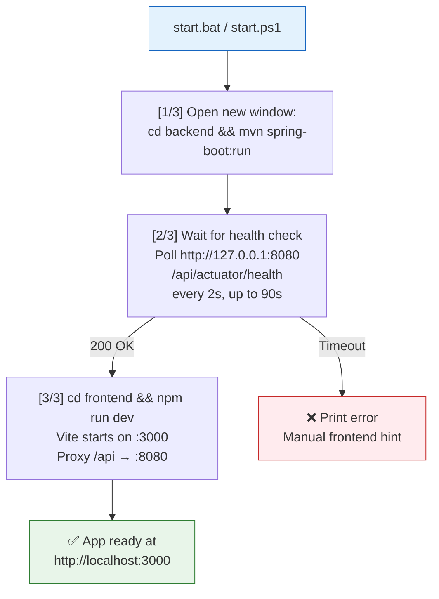

### Step-by-Step Setup

**1. Clone the repository**
```bash
git clone <repo-url> HospitalManagement
cd HospitalManagement
```

**2. Set up MySQL**
```sql
CREATE DATABASE hms CHARACTER SET utf8mb4 COLLATE utf8mb4_unicode_ci;
-- Default dev credentials: root / (your password)
```

**3. Configure database credentials**
```bash
cp backend/src/main/resources/application-local.yml.example backend/application-local.yml
# Edit backend/application-local.yml with your MySQL username and password
```

**4. Start backend**
```bash
cd backend
mvn spring-boot:run
# Wait for: "Started HmsApplication in X seconds"
# Health check: http://localhost:8080/api/actuator/health → { "status": "UP" }
```

**5. Start frontend (new terminal)**
```bash
cd frontend
npm install
npm run dev
# Wait for: "VITE ready in X ms"
# App: http://localhost:3000
```

**OR use the unified script:**
```bash
# Windows CMD
start.bat

# PowerShell
.\start.ps1
```

**6. Login**

| Username | Password | Role |
|----------|----------|------|
| admin | admin123 | ADMIN |
| doctor | doctor123 | DOCTOR |
| nurse | nurse123 | NURSE |
| pharm | pharm123 | PHARMACIST |
| bill | bill123 | BILLING |
| labtech | lab123 | LAB_TECHNICIAN |
| reception | rec123 | RECEPTIONIST |
| ipd | ipd123 | IPD_MANAGER |

**7. Verify**
- Dashboard loads at `http://localhost:3000`
- Sidebar shows modules based on role
- Register a patient via Reception → Patient Registration
- Create an OPD visit → complete it → check billing

### Optional: Pharmacy Invoice PDF
```bash
cd invoice-generator
pip install -r requirements.txt
# Spring will spawn Python automatically for invoice generation
```

---

## 16. KT Session Plan

### KT Schedule Overview

```mermaid
gantt
    title HMS Knowledge Transfer — 5 Sessions (~11 hours)
    dateFormat X
    axisFormat %s hrs

    section Session 1
    Business Overview           :s1, 0, 2
    section Session 2
    Architecture & Tech Stack   :s2, 2, 4
    section Session 3
    Codebase Walkthrough        :s3, 4, 7
    section Session 4
    Database & APIs             :s4, 7, 9
    section Session 5
    Deployment & Debugging      :s5, 9, 11
```

### Session 1: Business Overview (2 hours)
**Goal:** Understand the hospital workflow and HMS business logic.

| Topic | Duration | Resources |
|-------|----------|-----------|
| Hospital workflow overview (patient journey) | 30 min | Whiteboard / flowchart |
| HMS module map: Reception → OPD → IPD → Billing → Pharmacy → Lab | 30 min | docs/ folder |
| User roles and access levels | 15 min | `UserRole.java`, `sidebarMenu.ts` |
| Demo: Complete patient journey (register → OPD visit → IPD admit → discharge) | 30 min | Running app |
| Q&A and discussion | 15 min | |

### Session 2: Architecture & Technology (2 hours)
**Goal:** Understand system architecture, tech stack, and security.

| Topic | Duration | Resources |
|-------|----------|-----------|
| Architecture overview (monolith, packages, layers) | 20 min | This KT document §2 |
| Tech stack walkthrough | 15 min | `pom.xml`, `package.json` |
| Security: JWT flow, Spring Security config, RBAC | 30 min | `SecurityConfig.java`, `JwtTokenService.java` |
| Frontend architecture: React contexts, routing, API clients | 30 min | `App.tsx`, `main.tsx`, `api/client.ts` |
| Database: Hibernate DDL, entity hierarchy, key tables | 20 min | `BaseEntity.java`, entity files |
| Q&A | 5 min | |

### Session 3: Codebase Walkthrough (3 hours)
**Goal:** Navigate the codebase and understand code organization.

| Topic | Duration | Resources |
|-------|----------|-----------|
| Backend: Pick one module end-to-end (OPD recommended) | 45 min | `opd/` package |
| Controller → Service → Repository → Entity data flow | 30 min | IDE + debugger |
| Frontend: Pick one page end-to-end (OPD Visit Detail) | 30 min | `OPDVisitDetailPage.tsx` |
| Component → API Client → Type → Context flow | 20 min | `api/opd.ts`, `types/opd.ts` |
| Sidebar, permissions, and menu filtering | 20 min | `Sidebar.tsx`, `menuFilter.ts` |
| Complex module: Pharmacy (tabs, cards, stock) | 20 min | `PharmacyDashboard.tsx`, pharmacy components |
| Q&A | 15 min | |

### Session 4: Database & APIs (2 hours)
**Goal:** Understand data model and API contracts.

| Topic | Duration | Resources |
|-------|----------|-----------|
| ER diagram walkthrough (key relationships) | 30 min | This KT document §5 |
| Query patterns: derived queries, @Query JPQL, @EntityGraph | 20 min | Repository files |
| API testing with browser DevTools or Postman | 30 min | Running app |
| Error handling: GlobalExceptionHandler, frontend error display | 15 min | `GlobalExceptionHandler.java` |
| Billing data model (accounts, items, payments, refunds) | 15 min | `billing/` package |
| Q&A | 10 min | |

### Session 5: Deployment & Debugging (2 hours)
**Goal:** Run, debug, and deploy the system.

| Topic | Duration | Resources |
|-------|----------|-----------|
| Local setup verification (ensure everyone can run) | 20 min | §15 of this document |
| Debugging: backend (IDE breakpoints, logs, MDC) | 25 min | IDE |
| Debugging: frontend (React DevTools, Network tab, Vite proxy) | 25 min | Browser DevTools |
| Production configuration and security validators | 15 min | `application.yml`, `ProductionSecurityValidator.java` |
| Common issues and troubleshooting | 15 min | §14 of this document |
| Future roadmap: stubs, missing features, next priorities | 15 min | Unimplemented features list |
| Final Q&A | 5 min | |

---

## Appendix: Quick Reference

### Demo Login Credentials
| User | Password | Role |
|------|----------|------|
| admin | admin123 | ADMIN |
| doctor | doctor123 | DOCTOR |
| nurse | nurse123 | NURSE |
| pharm | pharm123 | PHARMACIST |
| labtech | lab123 | LAB_TECHNICIAN |
| reception | rec123 | RECEPTIONIST |
| bill | bill123 | BILLING |
| ipd | ipd123 | IPD_MANAGER |
| radtech | rad123 | RADIOLOGY_TECH |
| quality | quality123 | QUALITY_MANAGER |

### Key URLs (Development)
| URL | Purpose |
|-----|---------|
| http://localhost:3000 | Frontend app |
| http://localhost:8080/api/actuator/health | Backend health check |
| http://localhost:3000/admin/config/roles | Role management |
| http://localhost:3000/admin/config/permissions | Permission matrix |

### Module Documentation
| File | Content |
|------|---------|
| `docs/RECEPTION_MODULE.md` | Patient registration API |
| `docs/OPD_MODULE.md` | OPD visits, tokens, notes |
| `docs/IPD_MODULE.md` | 11-step admission SOP |
| `docs/DOCTOR_MODULE.md` | Doctor types, departments |
| `docs/NURSING_MODULE.md` | Nursing staff, vitals, notes |
| `docs/IPD_DAILY_MANAGEMENT_INTEGRATION.md` | Cross-module IPD integration |
| `docs/NABH-bed-allotment-compliance.md` | NABH bed allotment compliance |

---

*End of Knowledge Transfer Document*
